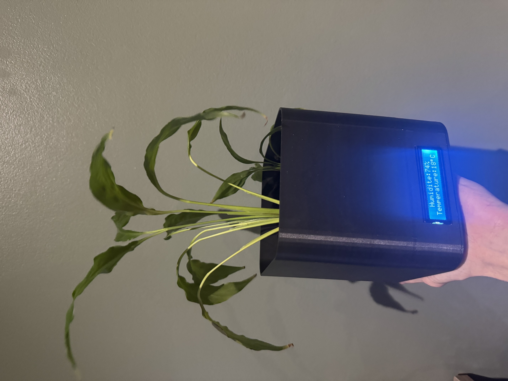
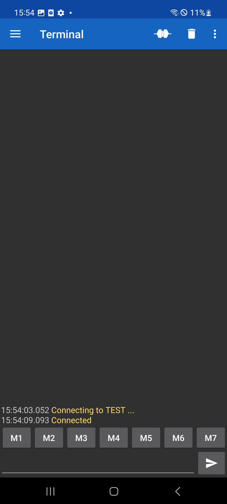
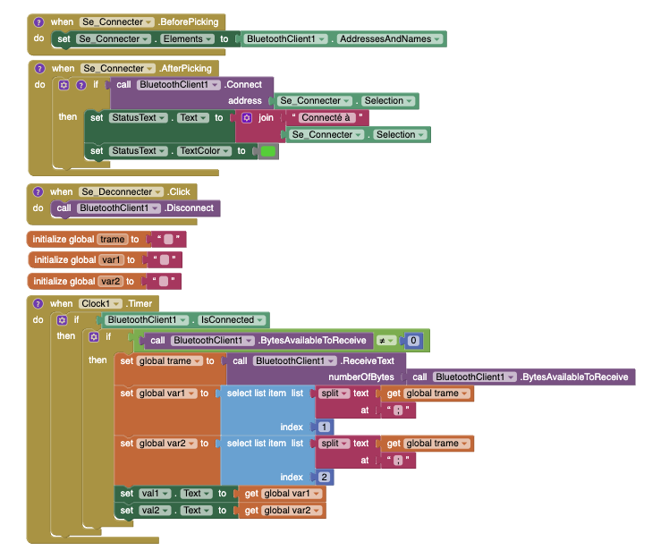
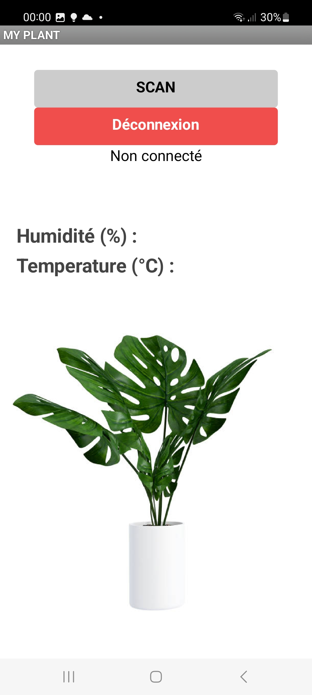

 

## Yoni Gaudiere

# PJE 2024 : Plante connecté 


 


## Introduction 

Ce projet vise à créer une plante intelligente qui est capable d'afficher l'humidité du sol et la température, facilitant ainsi un meilleur entretien de la plante.




Ce système est basée sur un Arduino Nano, qui recueille des données à partir de différents capteurs. Ces données sont ensuite transmises à une application mobile dédiée, développée avec MIT App Inventor, permettant une surveillance en temps réel. Le projet inclut un design personnalisé pour le pot de plante, conçu avec SolidWorks et imprimé en 3D avec des compartiments intégrés pour les composants électroniques et des ouvertures pour les éléments de contrôle comme l'écran et l'interrupteur.

## Liste d'équipement

- [Arduino nano / Carte Nano ATmega328
](https://www.amazon.fr/Elegoo-Pi%C3%A8ces-ATmega328P-Contr%C3%B4leur-Arduino/dp/B0722YYBSS/ref=sr_1_5?crid=4CUL7DR1O2MH&dib=eyJ2IjoiMSJ9.xO0mCdFPRjsgVeA_Ky8Z-m3Dqglmq8AMYeiQR8B-EKV-Of25chmzln6y2ImU-8_GDP7hhomnnm5Pg-H5iooIPhb0_scEVnMJIs1JzPNMLTlXXVCG1Ni8ctl8tY93XGbSq8t8IK05mNv4ZeSVMyJema9PCRISh4vi1ugahRn-rkqOYpPof3yUMj8c2zTi_M55Oj2YJd7H08PuDFmThlNWJC7B-s_DilclnEGcmab4KNTaGqdmPWkv4ZkisLNBCzYCm3w-7LTQcicXOm45aY5Lu4TO6z1dCly5QgVh4vbbjW8.0AP7kN6Lp5F5Kp9bH350U5FwS2HaLNgU6jLR4v2S7Ew&dib_tag=se&keywords=arduino+nano&qid=1709517285&sprefix=arduino%2Caps%2C84&sr=8-5 "Arduino nano").

- [ Module bluetooth HC-05 
](https://www.amazon.fr/AZDelivery-%C3%89metteur-R%C3%A9cepteur-Bluetooth-Compatible-Raspberry/dp/B0722MD4FY/ref=sr_1_5?crid=AOJH7UTBP0U6&dib=eyJ2IjoiMSJ9.o--iVk1HqTuuIGKoFpKPm8GwEhFpJ4rChIx9XO_8I7dBzaTUOAzOt1idnhknIg1D66J-qro4mEWnNABY-8gKjJJLlvoBFmP2UDSIN2RhNme0GOFWNC2_aVPoiYyXe0l2miMVE_cOKpeQmqpc4S-2Yw_CvqjAdEVtF2MVXYyFiPs_oi3dg0NWmRmxDwMPUzlupBC0U0sLkIlgjMsgGiyg1oWbIiBe5s_2X3bn_kq67ghbNGkCQoiHIJf-AXqFGiCZRe9zHE8PG8qnijgNDwjSIDMeKwrEMawZzIKdXRsxMos.HZwa9DeFfy3zFCgWYHufkEyGs2LQUrUJqKedjYAKFMI&dib_tag=se&keywords=bluetooth+hc-05&qid=1709517454&sprefix=bluetooth+hc%2Caps%2C76&sr=8-5 "Bluetooth HC-05 ").

- [ Capteur d'humidité 
](https://www.amazon.fr/dp/B07V2BBVQR?psc=1&ref=ppx_yo2ov_dt_b_product_details "Capteur d'humidité").

- [ Ecran LCD 
](https://www.amazon.fr/dp/B0B76YGDV4?psc=1&ref=ppx_yo2ov_dt_b_product_details "Ecran LCD").

- [ Capteur de temperature 
](https://www.amazon.fr/dp/B07D8S617X?psc=1&ref=ppx_yo2ov_dt_b_product_details "Capteur de temperature ").

##  Etape 1 : Capteur d'humidité 

Nous commencerons par brancher le capteur d'humidité.
#### Table de correspondance : 


  | Arduino | Capteur d'humidité |
   |---|---|
   | 5V | Vcc |
   | GND | GND |
   | A0 | AOUT |
  
Nous enverons ensuite ces valeurs sur le Serial Monitor :

```
const int sensorPin = A0;

void setup() 
{
  Serial.begin(9600);
}

void loop() 
{
  int sensorValue = analogRead(sensorPin);
  Serial.println(sensorValue);
  delay(1000);
}  

```

Nous allons maintenant dans la deuxième étape envoyer ces valeur en bluetooth a la place de les afficher sur le serial monitor.

##  Etape 2 : connection Bluetooth

Ce module communique via une liaison série avec une carte Arduino. Cette liaison s’établit sur deux
broches RX et TX définies dans notre programme en tant que broches 3 et 2.
La broche RX de la carte Arduino doit être raccordée à la broche TX du module Bluetooth HC-05. La
broche TX de la carte Arduino doit être raccordée à la broche RX du module HC-05.

#### Table de correspondance : 


  | Arduino | HC-05 |
   |---|---|
   | 3,3V | Vcc |
   | GND | GND |
   | 3 | RXD |
   | 2 | TXD |

Connecté vous ensuite en bluetooh sur votre smartphone. Il faut savoir que le HC-05 fonctionne avec android et non IOS. Télécharger une application terminal bluetooth comme par exemple "Serial Bluetooth Terminal". L'objectif va etre de lire les valeurs du capteur envoyer par bluetooth sur un smartphone android via l'application.



Voici le code à televerser sur la carte qui permet de faire cela : 

```
#include <SoftwareSerial.h>

SoftwareSerial btSerial(2, 3);

const int sensorPin = A0;

void setup() 
{
  Serial.begin(9600);
  btSerial.begin(9600);
}

void loop() 
{
  int sensorValue = analogRead(sensorPin);
  Serial.println(sensorValue);
  btSerial.print(sensorValue); 
  delay(1000);
}  
```

### Commande AT :

Les commandes AT sont des instructions utilisées pour configurer et interroger les modules de communication, tels que les modules Bluetooth HC-05. Ces commandes permettent aux utilisateurs de définir les paramètres du module, comme le nom du dispositif, le code PIN, le baud rate, le mode de fonctionnement (maître ou esclave), et bien d'autres aspects.
Si vous arriver a vous connecter au bluetooth et si vous ne rencontrer pas de problème il n'est pas indispensable de les utiliser. 

https://www.aranacorp.com/fr/votre-arduino-communique-avec-le-module-hc-05/

#### Attention : 

Différentes versions du module HC-05 existent et la liste des commandes AT et la procédure peuvent varier. Vérifiez bien le numéro de série écrit sur le module et la version du firmware en tapant la commande AT+VERSION?. Dans mon cas le module HC-05 a la version 3.0. Cette version ma demander une configuration différente concernant les commandes AT car de base le modul était détécter par aucun appareil. Cela ma un peu compliquer la tache mais j'ai fini par trouver en cherchant sur des forum. 

https://stackoverflow.com/questions/47010342/bluetooth-hc-05-sending-error-1f-for-inq-command-only

https://arduino.stackexchange.com/questions/50974/how-to-solve-problem-atinq-error-1f-atinit-error17-on-bluetooth-module-hc

Dans l'étape suivante nous allons afficher les valeurs convertie en pourcentage sur un écran LCD.

##  Etape 3 : Capteur de temperature

#### Table de correspondance : 


  | Arduino | capteur de temperature |
   |---|---|
   | 3.3V | Vcc |
   | GND | GND |
   | A4 | SDA |
   | A5 | SCL |

Ajouter la bibliothèque Adafruit pour le BMP085, qui fournit des fonctions facilitant l'interaction avec le capteur :

```
#include <Adafruit_BMP085.h>
```

On crée un objet bmp à partir de la classe Adafruit_BMP085. Cet objet sera utilisé pour appeler les fonctions qui interagissent avec le capteur :

```
Adafruit_BMP085 bmp;
```

On utilsie la fonction bmp.readTemperature() qui demande au capteur de réaliser une mesure de température et de renvoyer le résultat. La valeur renvoyée est typiquement en degrés Celsius : 

```
int temp = bmp.readTemperature();
```

On peu maintenant, comme pour l'humidité, envoyer cette valeur par bluetooth et l'afficher sur un écran LCD comme nous allons le voir dans la prochaine étape. 

##  Etape 4 : Ecran LCD

Installé la bibliothèque LiquidCrystal_I2C. Vous pouvez l'installer via le gestionnaire de bibliothèques de l'IDE Arduino en cherchant "LiquidCrystal_I2C".

#### Table de correspondance : 


  | Arduino | ecran LCD |
   |---|---|
   | 5V | Vcc |
   | GND | GND |
   | A4 | SDA |
   | A5 | SCL |

On importe donc la bibliothèque et on configure l'adresse I2C de l'écran :

```
#include <LiquidCrystal_I2C.h>

LiquidCrystal_I2C lcd(0x3F, 16, 2);  
```


Dans le setup on initialise l'écran LCD et on allume le rétroéclairage :

```
  lcd.init(); 
  lcd.backlight(); 
```

  Dans la loop on nettoi l'écran avant d'afficher la nouvelle valeur, puis on positionne le curseur pour indiquer sur quelle ligne nous allons afficher la valeur que le souhaite :

```
  lcd.clear(); 
  lcd.setCursor(0, 0); 
  lcd.print(humi);
  lcd.setCursor(0, 1); 
  lcd.print(temp); 
```

Comme on veux une valeur en pourcentage pour l'humidité on va créer une fonction pour faire cela en prénant comme référence la valeur du capteur d'humidité quand la terre est la plus sec et la valeur quand la terre est la plus humide : 

```
int convertirEnPourcentage(int valeur) {
  int minVal = 300;  
  int maxVal = 800; 
  int pourcentage = (maxVal - valeur) * 100 / (maxVal - minVal);
  return pourcentage;
}


```


##  Alimentation 

Composants Utilisés :

- [ Pile 
](https://www.amazon.fr/dp/B07G3786VW?psc=1&ref=ppx_yo2ov_dt_b_product_details "Pile ")

- [ Connecteur à Pile 
](https://www.amazon.fr/dp/B0BZ8F3957?psc=1&ref=ppx_yo2ov_dt_b_product_details "Connecteur à Pile  ")

- [ Interupteur
](https://www.amazon.fr/dp/B07CMG69BK?psc=1&ref=ppx_yo2ov_dt_b_product_details "Interupteur")

Le fil rouge du connecteur à pile doit être connecté à la broche Vin de l'Arduino Nano. La broche Vin accepte des tensions d'entrée généralement entre 7V et 12V, donc une batterie de 9V est appropriée pour cette entrée.

Le fil noir doit du connecteur à pile doit être connecté à l'une des broches GND (Ground) de l'Arduino Nano.

Pour contrôler l'alimentation du circuit sans avoir à déconnecter la pile, un interrupteur à bascule a été installé. Cela permet de mettre facilement le système en veille ou de l'activer.

Conseil : Les batteries de 9V (en particulier les types rectangulaires) ne sont généralement pas recommandées pour alimenter des projets Arduino qui consomment beaucoup d'énergie ou pour de longues périodes, car elles ne fournissent pas un courant élevé et s'épuisent rapidement.
Envisagez d'utiliser une batterie avec une capacité de courant plus élevée ou un pack de batteries AA/AAA en série qui peut fournir une alimentation plus stable.

## Application android 

J'ai développement une Application Mobile android avec MIT App Inventor. Cette mini app permet à un utilisateur de consulter les informations par bluetooth et de recevoir une notification quand la plante manque d'humidité. J'ai utiliser MIT App Inventor principalement pour la simplicité d'utilisation et l'accessibilité pour ceux qui ont des connaissances limitées en codage d'applications mobiles.

MIT App Inventor se distingue par son interface glisser-déposer qui rend le développement d'applications accessible même pour les débutants. Cet environnement de développement intégré fournit tous les outils nécessaires pour créer une application fonctionnelle sans écrire une seule ligne de code traditionnel. En effet elle fonctionne avec un sysyème de "block". 

Voici a quoi ressemble donc les blocks de mon app : 



### Logique de l'Application Mobile :

#### Établissement de la Connexion Bluetooth

L'application commence par initialiser la liste des dispositifs Bluetooth disponibles en utilisant le composant ListPicker. Lorsqu'un utilisateur choisit de se connecter, l'application tente d'établir une connexion avec le dispositif sélectionné. En cas de succès, elle affiche "Connecté à [Nom du Dispositif]" avec le nom du dispositif choisi et colore le texte en vert pour indiquer une connexion réussie. Si la tentative échoue, elle colore le texte en rouge pour signaler que la connexion a échoué.

#### Réception et Traitement des Données

L'application utilise un composant Clock pour interroger périodiquement le module Bluetooth et vérifier si de nouvelles données sont disponibles. Si c'est le cas, les données sont lues et stockées dans une variable globale trame. Cette trame de données est ensuite scindée en segments basés sur un délimiteur préétabli (dans notre cas, un caractère particulier). Les segments extraits sont affectés à des variables globales var1 et var2, correspondant à deux mesures distinctes provenant du système Arduino.

#### Affichage des Valeurs

Les valeurs extraites sont affichées dans l'interface utilisateur à l'aide de composants Label. Cette mise en page permet à l'utilisateur de surveiller en temps réel les valeurs de deux variables clés du système, telles que l'humidité et la température.



Pour utiliser cette application télécharger le fichier apk sur votre android : 

[fichier apk](AppliPlanteCO-1.apk)


## Conception 3D

Pour confectionner en plan 3D afin d'imprimer mon pot j'ai utiliser le logicel SolidWorks. j'ai concu un pot avec un amenagement en bas du pot pour y mettre mes composant et des trou afin de faire passer l'ecran et l'interupteur. 

vous trouverai dans le dossier conception3D tout le necessaire pour le plan. 

Si vous souhaitez simplement visualiser le model vous pouvez telecharcher eDrawings(disponible sur mac et pc) et ouvrir les deux fichier .stl

Pour la création du modèle 3D de mon pot, qui était destiné à l'impression 3D, j'ai opté pour le logiciel SolidWorks. J'ai conçu un pot comportant un compartiment pour accueillir les composants électroniques. Des ouvertures ont été prévues pour permettre le passage de l'écran et de l'interrupteur.

L'ensemble des plans et modèles 3D nécessaires à cette conception est regroupé dans le dossier nommé "conception3D".

Pour une simple visualisation du modèle sans modifier les plans, il est possible de télécharger le logiciel eDrawings, qui est compatible avec les systèmes d'exploitation Mac et PC. Ce logiciel vous permettra d'ouvrir et de consulter les fichiers .stl fournis.

[vidéo projet](Demo/demo1.mp4)

[vidéo du projet avec pot 3D](Demo/demo1.mp4)

[vidéo du projet avec pot 3D et plante](Demo/demo1.mp4)

## Amelioration possible

Le projet présente des possibilités d'évolution. Par exemple, en intégrant un capteur de luminosité, on pourrait ajuster plus finement les conditions de croissance en fonction de l'exposition à la lumière. De plus, l'application pourrait être améliorée pour inclure une fonctionnalité où l'utilisateur renseigne le type de plante dans le pot. L'application s'adapterait alors pour fournir des recommandations personnalisées sur l'humidité idéale, la luminosité nécessaire et la température ambiante optimale, car chaque espèce de plante a des besoins spécifiques. Cette personnalisation pousserait notre système de pot intelligent à un niveau supérieur, offrant un soin sur mesure pour chaque plante.